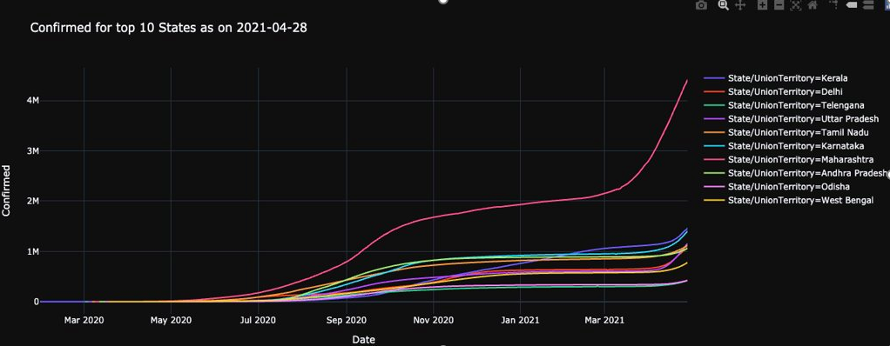
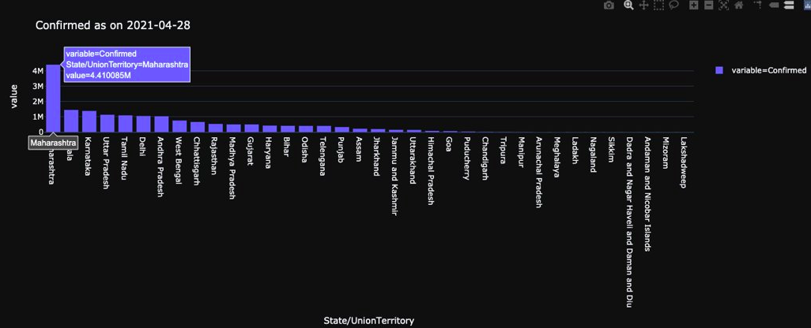
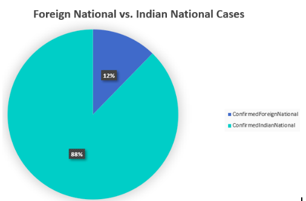

# Covid-19
Covid-19 has been widespread in India despite the efforts of suppressing it. India has taken several countermeasures, yet there are no significant signs of improvement. Such is the case due to the high transmission rate. This study aims to visualize the main cause of the difference in the severity of cases among the states of India. 

The dataset comprises the following characteristics that were concluded to conduct a comparative:
1.Time of the recorded dates
2.State/UnionTerritory
3.Confirmed Cases
4.Death rates per state
5.Recovery rate per state
6.Confirmed Foreign cases (COVID cases brought to India from foreign countries)
7.Confirmed Indian National cases (Domestic COVID cases)

Python provides a vast set of analytical tools that have been utilized to analyze the dataset. The selected libraries used are​ Numpy,​ Pandas, ​Scipy, ​Matplotlib pyplot, Seaborn​.  

Statistical Analysis was also conducted using the IBM SPSS software on the early phase of covid ie. March, is compared with the active covid cases all over India. The visualization model clearly showed that the major states that were most affected were the states that have major metropolitan cities.

Line plot: Monthly COVID cases per state/union territory (India)
India reported the first laboratory-confirmed case of coronavirus disease 2019 (COVID-19) on 30 January 2020 from Kerala. The following line plot expresses the growth of COVID cases over the course of one year in the states with most COVID cases. 

Bar graph: Mapping the prominence of COVID cases per state from January 2020 to March 2021
States with over 100 million confirmed COVID cases are expressed in the following bar graph. COVID prominence is arranged in ascending order such that top States are easily analyzed and identified.​ The Number of cases shows Maharashtra’s variance in the number of confirmed cases to be the largest compared to the next highest which is Kerala.

Pie chart: Source of COVID emersion in India: Confirmed Foreign cases vs. Confirmed Indian National cases
The initial screening strategy of the Indian Ministry of Health included passengers from China and subsequently expanded to include international travelers with the ongoing pandemic. The rapid spread of the outbreak to several countries posed a practical challenge in the implementation of temperature screening for a large number of passengers entering India.

